## 教程

1. [安装git](#安装git)
2. [下载代码](#下载代码)
3. [Anconda安装](#anconda安装)
4. [依赖安装](#依赖安装)
5. [安装Node.js](#安装nodejs)
6. [启动方式](#启动方式)
7. [项目代码更新](#项目代码更新)

### 安装git

下载群内的git软件


点击打开


一直点击下一步

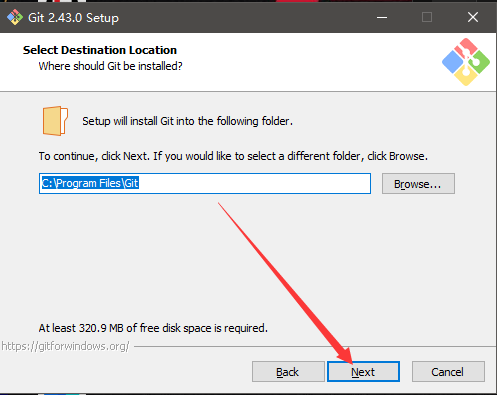


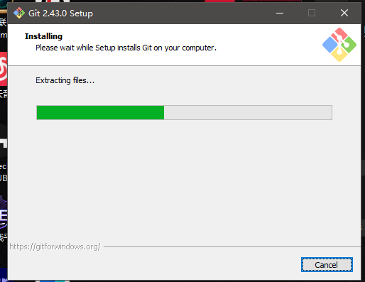

点击finish


### 下载代码

在桌面新建一个文件夹，这里文件名叫计算器

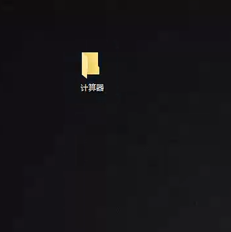

打开然后点击地址栏

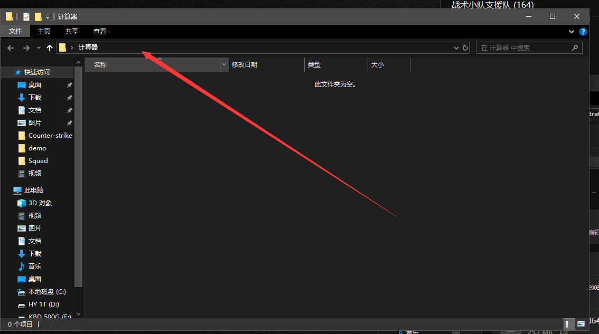

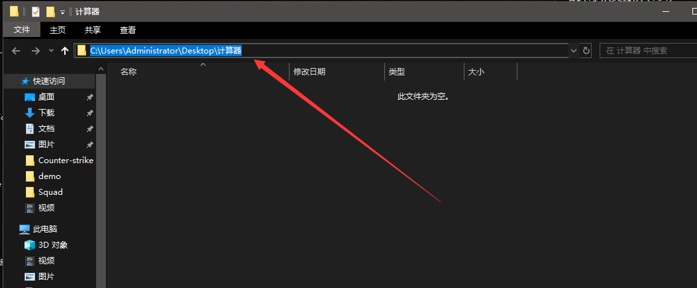

然后输入cmd回车

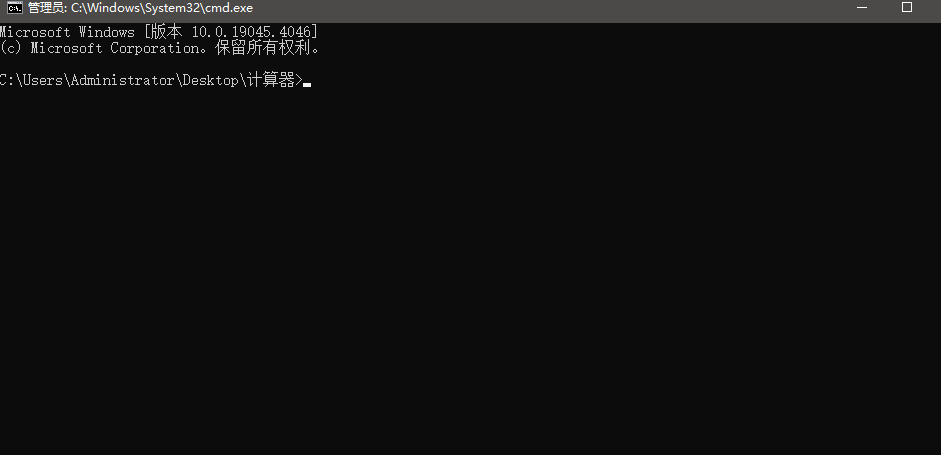

输入`git clone https://gitee.com/Zxl99/squard-automatic-mortars`下载代码

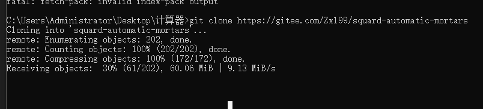

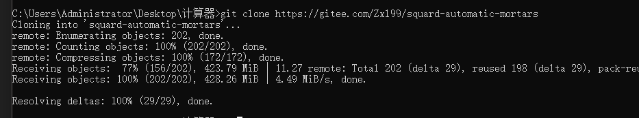

下载代码完成后输入`cd squard-automatic-mortars`进入项目目录

然后输入`git checkout main`切换到main分支

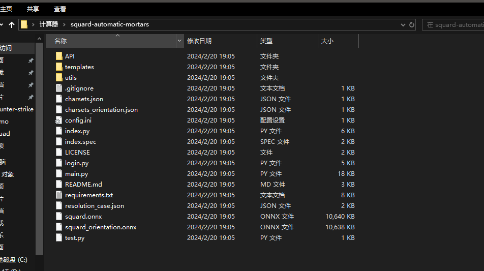

上图是完整的项目结构，至此代码下载完毕


### anconda安装

去https://www.anaconda.com/网站下载


安装完之后一路next然后Install即可，然后关闭窗口，

### 依赖安装

按win+s搜索an

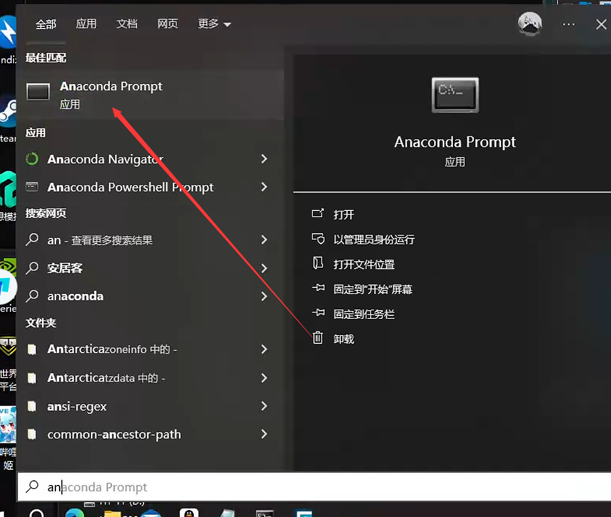

打开这个

然后输入conda create -n squad python=3.8.18安装python 环境

他会提示你让你按y，然后继续安装

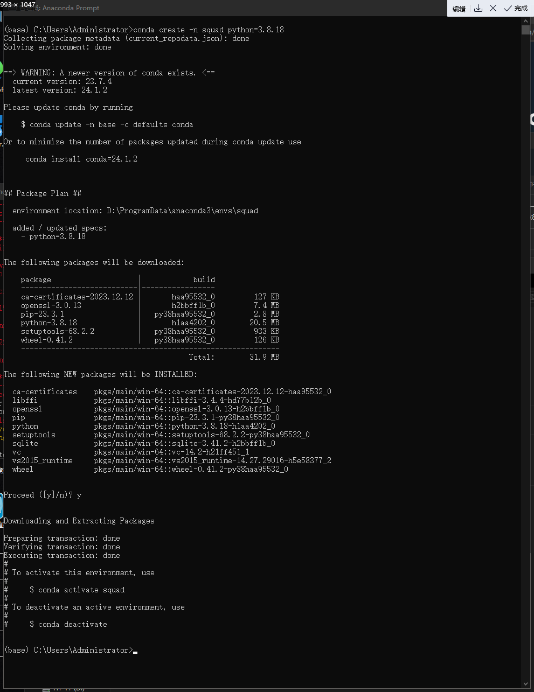

进入到你的项目目录

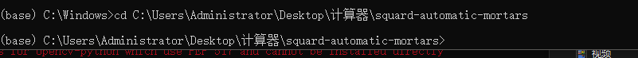

运行conda activate squad切换到这个环境

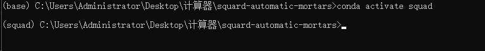

下载依赖pip install -r requirements.txt -i https://pypi.tuna.tsinghua.edu.cn/simple

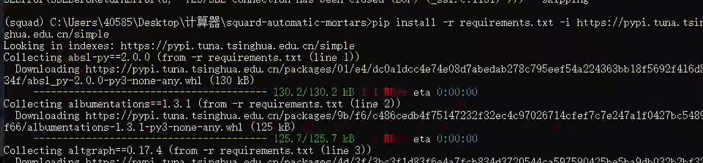

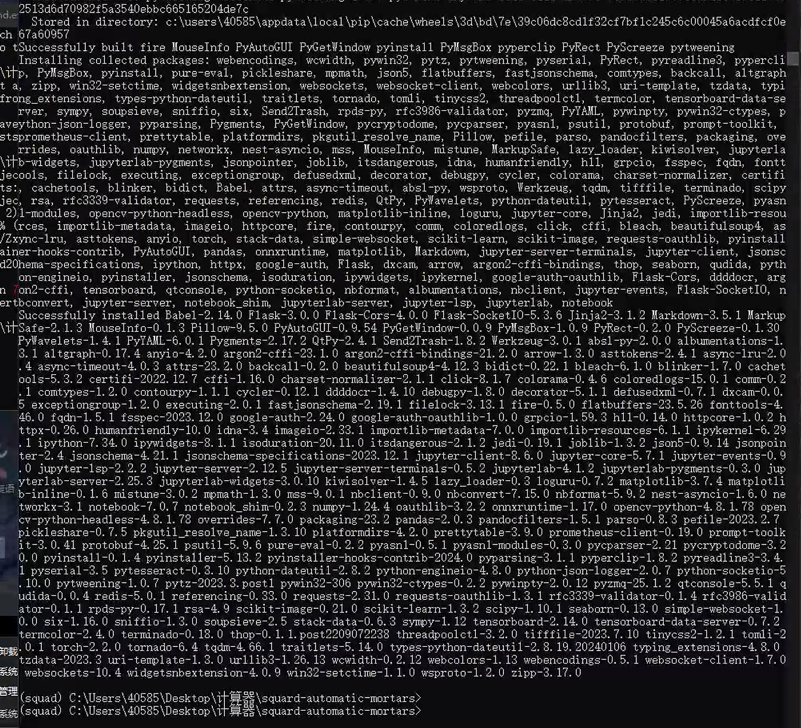

显示这么一大串就是安装依赖成功

如果安装失败

可以试试以下操作

下载群里的这个软件，然后打开

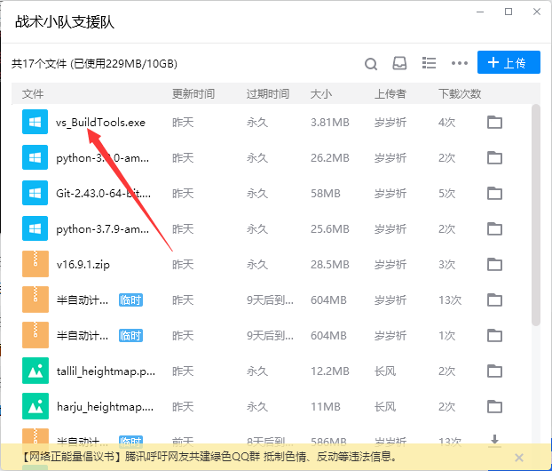


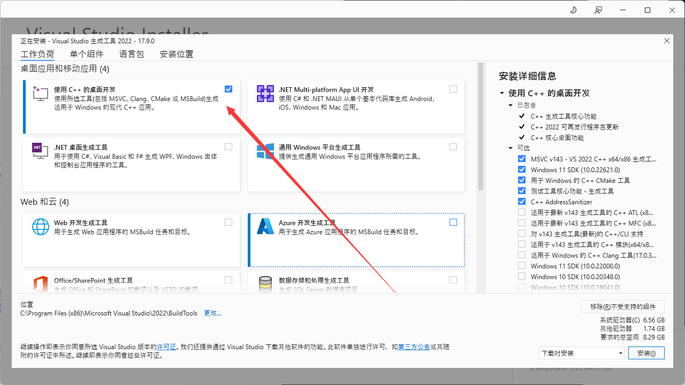


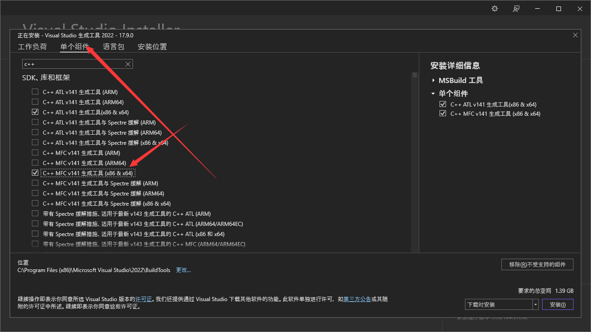

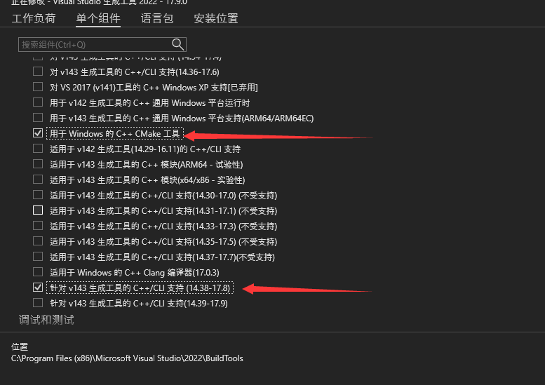

都选好后点击安装

安装完后再执行pip install -r requirements.txt -i https://pypi.tuna.tsinghua.edu.cn/simple

如果还有问题，群里问

### 安装node

下载群内的v16.9.1.zip

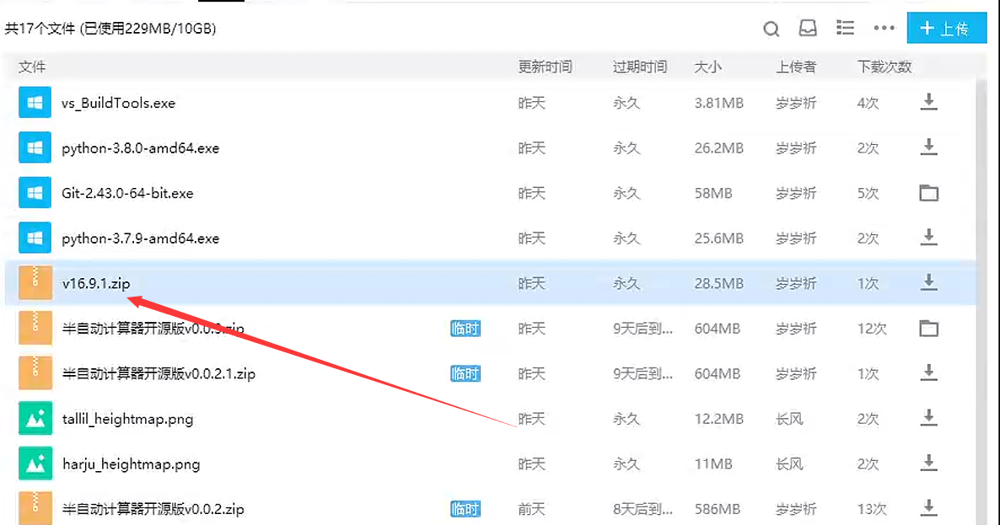

下载好好后放到项目文件夹下，然后点击解压到v16.9.1

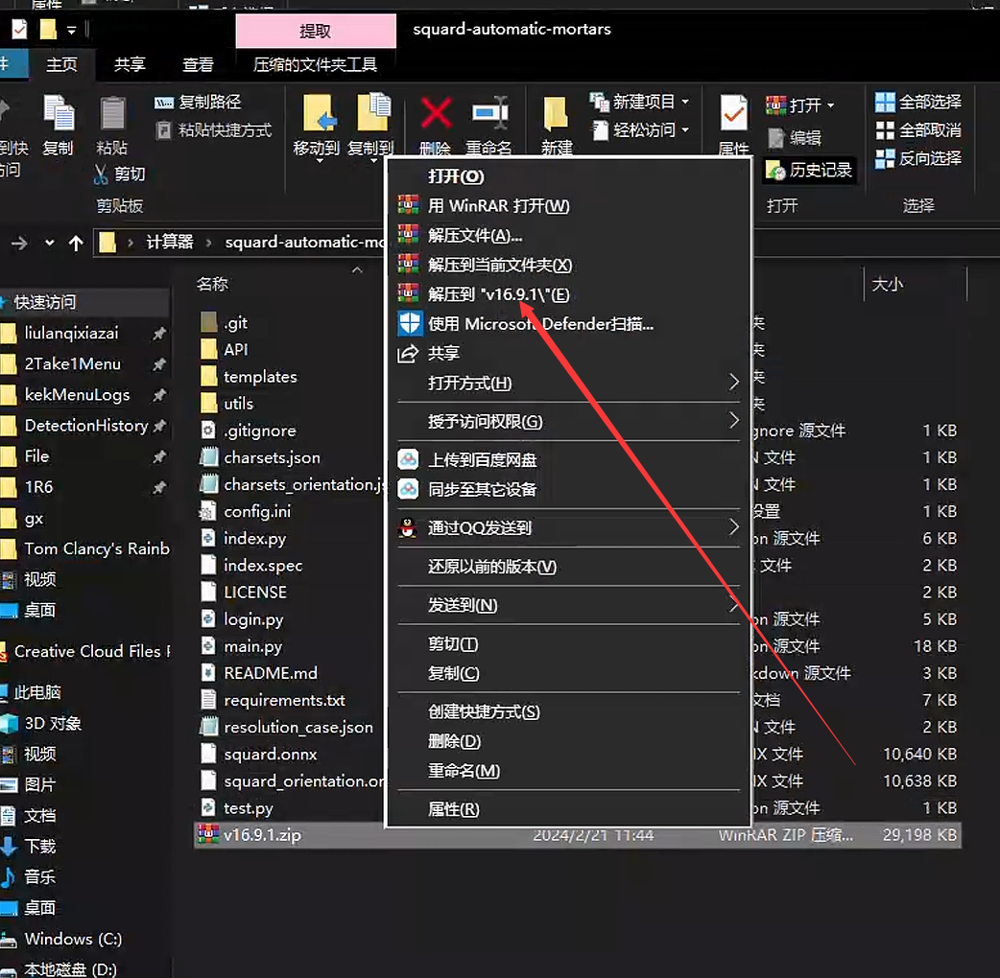

再回到刚才的命令窗口输入python index.py


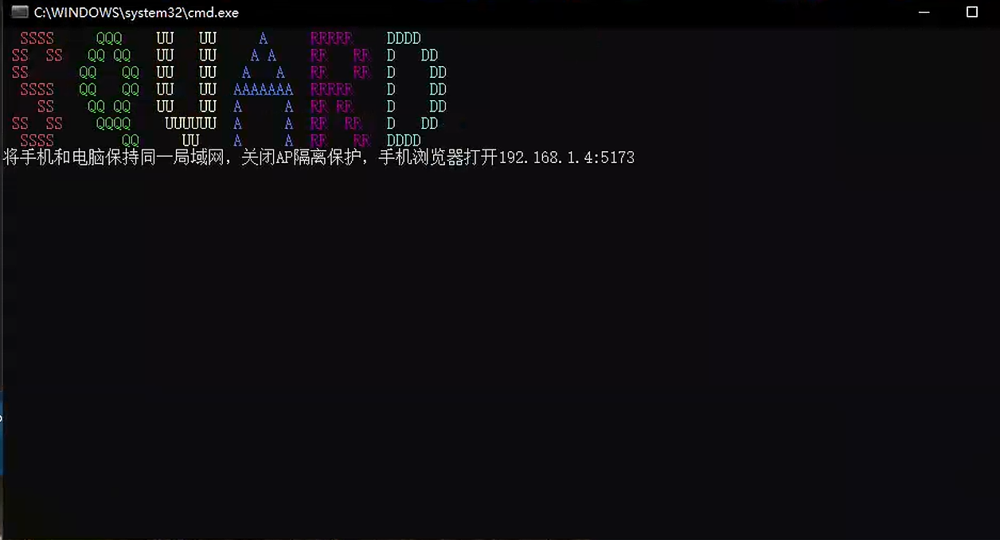

运行成功

### 启动方式

按win+s搜索an


打开后进入项目路径  

```
cd <你的项目路径>
conda activate squad
python index.py
```

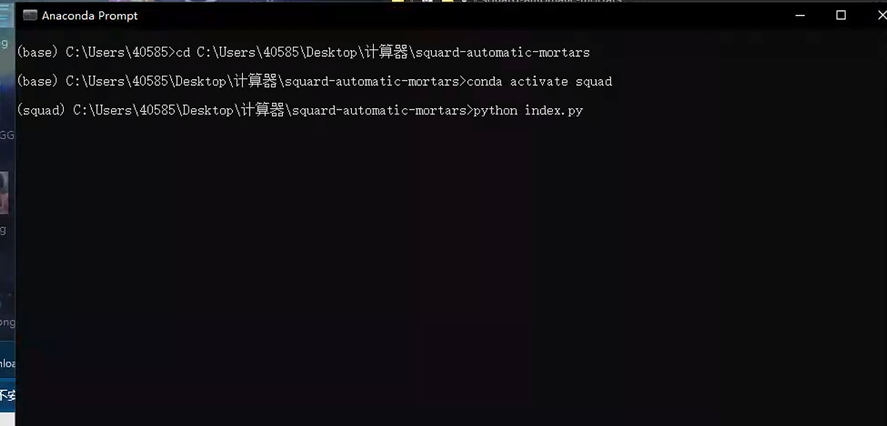

### 项目代码更新

直接在项目目录下运行git pull即可

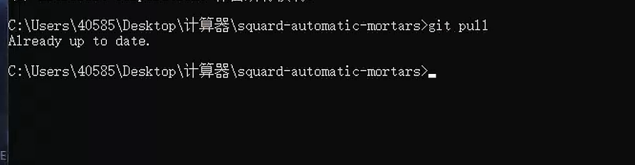
