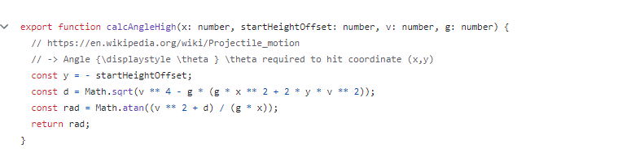
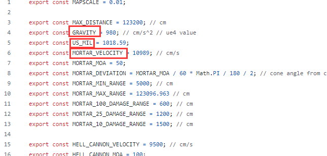
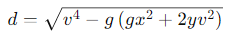
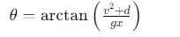
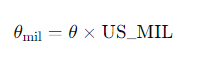
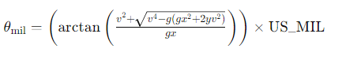
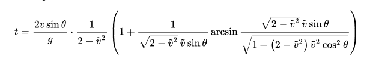

本贴讨论的是xyz计算器的计算方式，先给出关键代码

其中

- *x*：水平距离（从发射点到目标点）。
- *y*：垂直距离，这里是起始高度偏移的负值，即 *y*=*-startHeightOffset*
- *v*：发射速度。
- *g*：重力加速度。

其中*g*为980，*v*为10989 *cm/s*  即109 *m/s*,*US_MIL*为转换因子，这个函数算出来的密位还要乘这个转换因子才是最终密位

首先计算中间变量 *d*：

*d* 表示的是投射方程的一项，具体来说是根据初速度、重力、水平距离和高度差所得的二次方程的根的一部分。它是计算得出两个可能的投射角度（一个较高和一个较低）中的一个所必需的。

然后使用这个中间变量 *d* 来计算发射角度 *θ* 的弧度值：

还记得刚开始提到的转换因子吗，还得加上转换因子

所以最终的完整公式为

至此，xyz的计算原理就探究完毕了，后面会出贴探究xyz是怎么计算出迫击炮的落地时间的，先甩个公式

